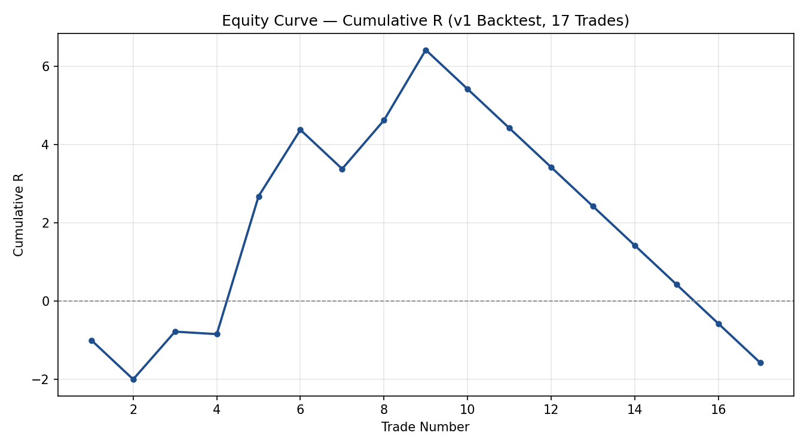

# FTSE 100 Liquidity Sweep + IFVG Backtester

A Python backtesting engine for a discretionary FTSE 100 trading strategy I trade manually using chart-based visual analysis. Built to objectively evaluate the strategy's historical performance with hard numbers, rather than relying on subjective visual review, testing liquidity sweeps of recent swing highs/lows followed by confirmation via an Inverse Fair Value Gap (IFVG) on the 5-minute chart, within a defined morning trading session (08:00–12:00 UK time).

## Methodology

Historical FTSE 100 price data was sourced from Yahoo Finance. Due to Yahoo's 60-day limit on intraday (5-minute) data, the backtest covers a rolling 60-day window rather than a fixed historical period.

**Entry logic:** The backtester identifies structural swing highs/lows on the 1-hour and 4-hour timeframes. When a 5-minute candle's wick sweeps (breaks) one of these levels, it searches for the most recent Fair Value Gap (FVG) on the 5-minute chart in the opposite direction. A trade is entered when a subsequent 5-minute candle closes back through that FVG, confirming an "Inverse FVG" (IFVG).

**Stop loss:** Placed 0.8 points beyond the far edge of the IFVG zone (in the direction against the trade).

**Take profit:** The backtester searches a four-layer fallback hierarchy, in order, using the first candidate that achieves a reward-to-risk ratio of at least 1:1:
1. Nearest 15-minute swing high/low
2. Nearest 15-minute FVG
3. Nearest 1-hour swing high/low
4. Nearest 1-hour FVG

If no candidate across all four layers satisfies R:R ≥ 1, the trade is excluded from results (not counted as a loss).

**Trade exit:** Each trade is simulated forward candle-by-candle until stop loss or take profit is hit. If neither level is reached by 16:30 (UK market close), the trade is force-closed at the last available price and recorded separately as `closed_eod`, rather than being counted as a win or loss.

## Results

Backtest run on 60 days of 5-minute FTSE 100 data (rolling window, results vary slightly run-to-run — see Limitations):

| Metric | Value |
|---|---|
| Total trades | 17 |
| Win rate | 29.4% |
| Total R | -1.57R |
| Expectancy per trade | -0.09R |
| Max drawdown | -8.00R |

Of the 17 trades, 16 resolved via stop loss or take profit; 1 was force-closed at end of day (16:30) with neither level hit.

The backtest shows a net loss over this sample. See Limitations for the likely contributing factors and how this coded ruleset differs from live discretionary execution.



## Limitations

This backtest is a deliberately simplified, codified version of the live strategy, built to test a specific, well-defined ruleset rather than full discretionary judgement. Key limitations:

- **Data mismatch**: Historical data is sourced from Yahoo Finance's `^FTSE` index, which only covers UK cash-market hours (08:00–16:30). This does not match the near-24-hour session of the actual instrument traded live (UK 100 CFD via Spreadex on TradingView), meaning overnight liquidity levels and correctly-anchored 4-hour candles (which on the real chart open at 01:00, 05:00, 09:00, etc.) are not modelled. 4-hour candles in this backtest are anchored to 08:00 instead.
- **Non-reproducible results**: Data is pulled via `yfinance` with a rolling 60-day window based on the current date, not a fixed dataset. Re-running the script pulls a slightly different 60-day period each time, so exact trade counts and metrics will vary marginally between runs.
- **Small sample size**: 17 trades is not statistically sufficient to draw firm conclusions about the strategy's real edge.
- **No slippage modelled**: Trade entries assume the exact closing price of the confirming candle, with no allowance for execution delay or slippage.
- **Simplified take-profit logic**: TP uses a mechanical 4-layer fallback hierarchy (nearest qualifying 15-min swing point → 15-min FVG → 1-hour swing point → 1-hour FVG, each requiring R:R ≥ 1) rather than the fuller discretionary "draw on liquidity" judgement used in live trading.
- **No minimum FVG size threshold**: Any price gap, however small, currently qualifies as a valid FVG.
- **Directional bias is not enforced**: The 4-hour/daily directional bias used for context in live trading is not applied as a hard filter in the backtest.
- **Same-candle SL/TP ambiguity**: Since only 5-minute OHLC data is available (not tick data), when a single candle touches both the stop loss and take profit, the backtest conservatively assumes the stop loss was hit first.

During development, a 1.82-point stop-loss buffer was found to improve backtest results over the original 0.8-point buffer. This was not adopted for the official v1 result, as tuning a parameter against the only available dataset risks overfitting; the official result uses the original, independently-chosen 0.8-point buffer. Out-of-sample validation on a larger dataset would be needed to confirm whether this is a genuine improvement.

## Planned v2 Improvements

- Rebuild using exported TradingView data to match the real trading instrument's session hours and correctly-anchored 4-hour candles
- Out-of-sample testing of the stop-loss buffer once more historical data is available
- Calibrate a minimum FVG size threshold against real chart examples
- More realistic entry/slippage modelling
- Extend the TP fallback hierarchy with additional discretionary-style layers (e.g. 5-minute draws on liquidity) for the rare cases where none of the current four layers qualify

## Setup / How to Run

**Requirements:**
```
pip install yfinance pandas
```

**Run:**
```
python backtester.py
```

The script downloads the latest 60 days of 5-minute FTSE 100 data on each run (see Limitations — results will vary slightly run-to-run), builds the full signal pipeline, and produces a trade log (`trade_log_df`) with per-trade results and summary performance metrics (win rate, total R, expectancy, max drawdown).

